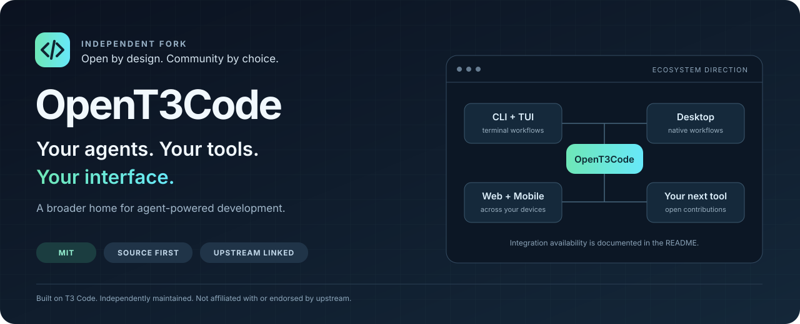
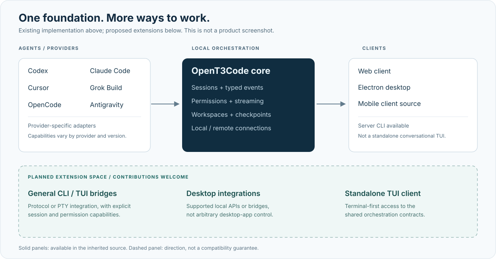

<div align="center">
  

# OpenT3Code

**An open, community-driven home for coding agents — across CLI, desktop, web, mobile, and terminal workflows.**

[Get started](#run-this-fork) · [Compatibility](#what-works-today) · [Contribute](./CONTRIBUTING.md) · [Upstream maintenance](./docs/operations/opent3code.md)

[](./LICENSE)


</div>

## Your workflow should not depend on one interface

OpenT3Code is an independently maintained fork of [T3 Code](https://github.com/pingdotgg/t3code). It keeps the upstream foundation for running coding agents on your own machine, while opening the contribution scope to more tools and more ways of working.

**Our direction is broad compatibility, not a preferred-vendor list:** command-line agents, terminal user interfaces, desktop integrations, browser clients, mobile clients, and remote workflows should all have a place here. A tool's interface should not decide whether it belongs in the ecosystem.

> [!IMPORTANT]
> **Open to every tool does not mean every tool is already integrated.** This fork currently inherits the adapters and clients listed below. A universal CLI adapter, a standalone OpenT3Code TUI, and arbitrary desktop-app control are extension goals, not shipped features. Launching a process is not the same as supporting structured sessions, permissions, streaming, or recovery.

## What makes this fork different?

|                 | T3 Code foundation                                   | OpenT3Code direction                                                                      |
| --------------- | ---------------------------------------------------- | ----------------------------------------------------------------------------------------- |
| Agent execution | Provider-specific adapters and orchestration         | Keep those adapters; welcome additional runtimes and protocols                            |
| Interfaces      | Web, Electron desktop, and mobile clients            | Preserve them; make terminal-first and other client contributions welcome                 |
| Contributions   | Governed by the upstream contribution policy         | Accept focused provider, CLI, TUI, desktop, accessibility, and interoperability proposals |
| Maintenance     | Upstream development and releases                    | Traceable upstream merges, independent review, and preservation of fork-specific changes  |
| Distribution    | Upstream packages, applications, and hosted services | Source-first fork; do not represent upstream binaries or services as our own              |

This is a difference in **project scope and maintenance policy**, not a claim that the new integrations already exist. We credit the upstream project and do not imply its endorsement.

## What works today

### Agent integrations inherited from upstream

| Agent              | Integration available in the current source | Getting connected                                                        |
| ------------------ | ------------------------------------------- | ------------------------------------------------------------------------ |
| Codex              | Provider adapter                            | Install and authenticate its CLI                                         |
| Claude Code        | Provider adapter                            | Install and authenticate its CLI                                         |
| Cursor             | Provider adapter                            | Install and authenticate Cursor CLI                                      |
| Grok Build         | Provider adapter                            | Install and authenticate its CLI                                         |
| OpenCode           | Provider adapter                            | Install and authenticate OpenCode                                        |
| Google Antigravity | Provider adapter                            | Enable it in Settings, then use its installation and Google sign-in flow |

Availability depends on your operating system, installed provider version, account, and the individual adapter's capabilities. This table describes code present in the inherited implementation; it is not a fresh end-to-end certification of every provider.

### Interfaces and integration boundaries

| Surface or tool                         | Status              | What this means                                                                      |
| --------------------------------------- | ------------------- | ------------------------------------------------------------------------------------ |
| Local web interface                     | Available in source | Run the server and browser client from this checkout                                 |
| Desktop application                     | Available in source | Electron client; use the source development/build commands below                     |
| Server CLI                              | Available in source | Start and manage the inherited server; not a standalone conversational TUI           |
| Mobile clients                          | Available in source | Inherited React Native clients; branded store releases are not provided by this fork |
| Terminal / TUI-based agents             | Adapter-dependent   | A tool needs a compatible protocol or an implemented adapter for managed sessions    |
| Standalone OpenT3Code TUI               | Planned             | Contributions welcome; no standalone terminal client is shipped yet                  |
| Arbitrary CLI / third-party desktop app | Planned             | Requires an integration contract or bridge; not universal GUI automation             |



## Run this fork

Use **Node.js 24.13.1 or a compatible 24.x release**, as required by the root `package.json`, and install [Vite+](https://viteplus.dev/guide/). The checked-in package manager and lockfile are the source of truth.

```bash
# The repository slug is being migrated from t3code to opent3code.
# The existing URL remains the bootstrap URL until the GitHub rename is complete.
git clone https://github.com/Hylouis233/t3code.git opent3code
cd opent3code
vp i

# Start the local server and web client.
vp run dev
```

Use the local address printed by the development runner. Install and authenticate at least one supported agent before starting a session. Development uses checkout-local state; do not point it at an existing production profile.

For the desktop client:

```bash
vp run dev:desktop
```

For a desktop build:

```bash
vp run build:desktop
```

See the [development runbook](./docs/operations/development.md#first-checkout) for native dependencies and [platform-specific packaging](./package.json) commands.

> [!NOTE]
> `npx t3@latest`, the official T3 desktop installers, and the T3 App Store / Play Store applications install **upstream T3 Code**, not this fork. No `opent3code` npm package or independently branded binary is promised here. Internal `t3` / `@t3tools` package names, protocol identifiers, and application IDs remain unchanged for now; release identity and data migration require a separate, tested change.

## Extending the ecosystem

We welcome integrations for **CLI, TUI, desktop, web, mobile, and remote tools**, without restricting proposals to the existing provider list.

A managed integration should state its actual capabilities: executable or endpoint discovery, authentication, session creation and resume, streaming, cancellation, permission prompts, working-directory isolation, errors, and recovery. Unsupported capabilities must be explicit. A terminal process should not be presented as a fully managed agent merely because it can be launched.

Start with the existing [provider boundary](./apps/server/src/provider), [shared contracts](./packages/contracts), and [contribution guide](./CONTRIBUTING.md). Put runtime-specific complexity in an adapter rather than adding provider-specific behavior throughout the clients. Never bypass a tool's authentication or permission model.

## Staying current with upstream

The [upstream sync workflow](./.github/workflows/opent3code-sync.yml) checks `pingdotgg/t3code:main` daily and can also be run manually. New upstream commits — including PRs already merged there — are proposed in a dedicated sync PR. The candidate is validated without write credentials; only a passing, unchanged candidate can be merged automatically.

Conflicts, changed fork-maintenance files, failed validation, or repository protection rules stop automatic merging. **Open, unmerged upstream PRs are not batch-merged.** They need separate review and an explicit selection. See [maintenance and rename instructions](./docs/operations/opent3code.md) for permissions, review gates, and recovery.

## Documentation

[Installation](./docs/user/install.md) · [Permissions](./docs/user/permission-modes.md) · [Keyboard shortcuts](./docs/user/keybindings.md) · [Project settings](./docs/user/project-settings.md) · [Remote access](./docs/user/remote-access.md) · [Source control](./docs/user/source-control.md) · [Architecture](./docs/internals/overview.md)

Some inherited guides still describe upstream names, distribution channels, and hosted services. The fork-specific installation and compatibility notes on this page take precedence for OpenT3Code.

## Contributing

Focused fixes, new adapters, terminal-first workflows, desktop integrations, documentation, and accessibility improvements are welcome. Propose a larger feature in a **draft PR against this fork** before implementing it. Include compatibility limits, test evidence, and screenshots or recordings for visible changes. Do not send fork-specific support requests to upstream.

Read [CONTRIBUTING.md](./CONTRIBUTING.md) and the engineering guidance in [AGENTS.md](./AGENTS.md). The fork contribution policy takes precedence over inherited product-policy statements.

## License and attribution

[MIT](./LICENSE). OpenT3Code is derived from T3 Code by its upstream authors and contributors. Existing copyright, license, and third-party notices are retained. Names and logos of third-party products belong to their respective owners.
